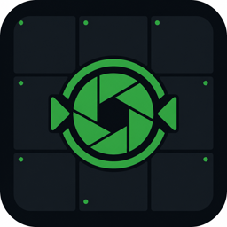

# intelbras-simlite

<p align="center">
  
</p>

Viewer **leve e open source** de CFTV Intelbras (DVR/NVR), feito em **Rust + Slint**.

Objetivo: live e reprodução do HD do DVR via **RTSP**, sem depender do SIM Next (pesado) e **sem baixar** arquivos `.dav` pro PC.

Licença: [MIT](LICENSE).

---

## Downloads (releases)

Builds oficiais (Windows / Linux / macOS) saem automaticamente a cada tag `v*`:

**https://github.com/yagodaoud/intelbras-simlite/releases**

| Plataforma | Arquivo |
|------------|---------|
| Windows x64 | `simlite-windows-x64.zip` |
| Linux x64 | `simlite-linux-x64.tar.gz` |
| macOS Apple Silicon | `simlite-macos-arm64.tar.gz` |
| macOS Intel | `simlite-macos-x64.tar.gz` |

Em todas as plataformas é necessário ter o **FFmpeg** no `PATH`.

---

## O que faz

- **Ao vivo** — mosaico automático (1 / 2 / 4 / 6) conforme as câmeras selecionadas
- **Reprodução** — gravação do HD do DVR por RTSP (timeline do dia, seek, 0.5x / 1x / 2x / 4x)
- **Modo Qualidade / Performance** no live (opção salva localmente)
- Zoom com scroll no ponto do cursor + arrastar (mãozinha) para navegar
- Arrastar tiles no mosaico para trocar posição (preferência salva)
- Senha no **Credential Manager** do Windows — nunca em `config.json` nem em logs

---

## Requisitos

| Item | Detalhe |
|------|---------|
| SO | Windows 10/11, Linux ou macOS |
| [Rust](https://rustup.rs/) | toolchain estável (`rustup` / `cargo`) — só para build |
| [FFmpeg](https://ffmpeg.org/) | no `PATH` (`ffmpeg -version` deve funcionar) |
| DVR/NVR Intelbras | RTSP acessível na rede (porta típica `554`) |

Conta no DVR: preferir usuário **viewer** (não `admin`), com permissão de live e playback.

### Linux (deps extras para compilar)

```bash
sudo apt-get install -y \
  libxcb-shape0-dev libxcb-xfixes0-dev libxcb-render0-dev \
  libxcb-render-util0-dev libxcb-icccm4-dev libxcb-image0-dev \
  libxcb-keysyms1-dev libxcb-randr0-dev libxcb-util-dev \
  libxcb-cursor-dev libxkbcommon-dev libxkbcommon-x11-dev \
  libwayland-dev libegl1-mesa-dev
```

---

## Build

```bash
# Dependências (só na primeira vez)
rustup update
ffmpeg -version

# Build de desenvolvimento
cargo build

# Build de produção (recomendado)
cargo build --release
```

Binário release:

- Windows: `.\target\release\simlite.exe`
- Linux / macOS: `./target/release/simlite`

Testes:

```bash
cargo test
```

### Publicar uma release

```bash
git tag v0.1.0
git push origin v0.1.0
```

O workflow [Release](.github/workflows/release.yml) compila nas quatro plataformas e anexa os artefatos à release do GitHub. Também dá para disparar manualmente em **Actions → Release → Run workflow**.

---

## Executar

```bash
cargo run --release
# ou o binário em target/release/
```

Na primeira abertura:

1. Informe IP/host do DVR, usuário e senha
2. Portas RTSP (ex.: `554`) e HTTP (só se for usar CGI; a reprodução usa RTSP)
3. Quantidade de canais
4. **Salvar e conectar** — a senha vai para o Credential Manager (Windows)

Configuração (sem senha):

- Windows: `%AppData%\simlite\SIM Lite\config\config.json`
- Linux/macOS: diretório de config do projeto via `directories` (`simlite` / `SIM Lite`)

---

## Uso rápido

### Ao vivo

- Marque câmeras na sidebar — o grid ajusta sozinho
- **Qualidade** = stream principal, mais FPS/resolução
- **Performance** = substream, mais leve no CPU
- Scroll no vídeo = zoom; com zoom, arraste com a mãozinha
- Arraste um tile sobre outro para reordenar (borda verde no alvo)
- Duplo clique no tile remove; a próxima câmera clicada na lista preenche o slot

### Reprodução

- Selecione uma ou mais câmeras (grid como no ao vivo)
- Escolha a data no calendário
- **Abrir reprodução**
- Timeline: horas do dia, barra verde, playhead; clique para seek
- Scroll na timeline = zoom da escala; botões `−` / `+` também
- Velocidades: o DVR não acelera RTSP de verdade — em 2x/4x o app avança com seek-jump

---

## Segurança (resumo)

- Senha **nunca** entra em `config.json`, logs, `Display`/`Debug` ou mensagens de erro
- Host/usuário validados (sem injeção em URL RTSP/CGI)
- RTSP sempre com transporte **TCP**
- Playback vem do HD do DVR (RTSP), não download local de `.dav`

---

## Stack

- **Rust** — domínio, RTSP, player (FFmpeg subprocess → RGB)
- **Slint** — UI
- **FFmpeg** — decode (hwaccel quando disponível)

---

## Limitações conhecidas

- CGI de busca de gravações pode falhar se a porta web do DVR não for alcançável; a timeline assume presença contínua no dia quando não há lista CGI
- Modelos/firmwares Intelbras variam — se o RTSP live ou playback falhar, confira usuário, porta e firewall

---

## Contribuir

Issues e PRs são bem-vindos. Mantenha o espírito do projeto: leve, seguro com credenciais, e sem baixar o arquivo de gravação pro disco local sem necessidade.

```bash
git clone https://github.com/yagodaoud/intelbras-simlite.git
cd intelbras-simlite
cargo test
cargo build --release
```

---

## Licença

MIT — veja [LICENSE](LICENSE).
